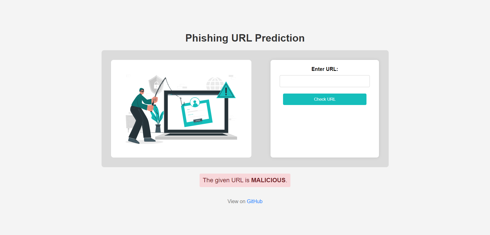

# Phishing Domain Detection

<!--
## Project Workflow
1. GitHub Repository Setup
2. Project Template Creation
3. Project Setup & Requirements Installation
4. Logging, Utils & Exception Module
5. Project Workflows
6. All Components Notebook Experiment
7. All Components Modular Code Implementation
8. Training Pipeline
9. MLflow (MLOps Tool) - For Experiments tracking & Model Registration
10. DVC (MLOps Tool) - For Pipeline Tracking & implementation
11. Prediction Pipeline & User App Creation
12. Docker
13. Final CI/CD Deployment on AWS

- Update config.yaml
- Update the entity
- Update the configuration manager in src config
- Update the components
- Update the pipeline
- Update the main.py
- Update the dvc.yaml
- app.py

## Tools used
-->

#### 🔥 Official Website 👉 [Yet To Be Done](#)
Enter any URL to know if it's malicious or not.
<br/>

<!--
<div align="center">

</div>
-->

## 🎯 Objective
Phishing is a type of fraud in which an attacker impersonates a reputable company or person in order to get sensitive information such as login credentials or account information via email or other communication channels. Phishing is popular amongattackers because it is easier to persuade someone to click a malicious link that appears to be authentic than it is to break through a computer's protection measures.

The main goal is to predict whether the domains are real or malicious.


<div align="center">

</div>


## 🔄 Project Workflow

<div align="center">

</div>

We'll go through different stages of data collection,feature extraction,training and finally deployment of trained model.

1. Data Collection
2. Feature Extraction
3. Model training & evaluation
4. Deployment


### 1. Data Collection

The dataset can be found [here](https://data.mendeley.com/datasets/72ptz43s9v/1). Complete data description can be found [here](https://www.sciencedirect.com/science/article/pii/S2352340920313202#section-cited-by).

These data consist of a collection of legitimate as well as phishing website instances. Each website is represented by the set of features which denote, whether website is legitimate or not. Data serves as an input for machine learning process.

In this repository the two variants of the Phishing Dataset are presented: full variant and small variant.

In this project, the full variant is used which consists of 88,647 instances. The count of legitimate instances is 58,000 and the count of malicious instances is 30647. Since the minority class is 34.57% of the dataset, it does
not cause a severe imbalance problem.

The data consists of 111 independent features and 1 target feature.

### 2. Feature Selection

The dataset initially contained a large feature space of 111 features, making it computationally expensive to process all features. Many of these features might not contribute to the model's performance and could even hinder it.

To address this, invalid and redundant features were removed, reducing the dataset to 77 features. More details on this process can be found [here](Research/01_feature_selection.ipynb).

Next, we utilized the `feature_importances_` attribute from the Random Forest Classifier to identify the most important features. This selection process resulted in a final dataset of 53 features, which will be used for further analysis. Further information on this step is available [here](Research/02_feature_selection.ipynb).


### 3. Model Training

The machine learning models considered to train the dataset in this project are :
- Decision Tree Classifier
- Random Forest Classifier
- XGBClassifier
- CatBoost Classifier
- Gradient Boosting Classifier
- Multilayer Perceptron

For this dataset Random Forest Classifier gave the highest accuracy (97%) with suitably balanced precision and recall. This can be seen [here](Research/05_test-all-models.ipynb)

## 💻 Tech Stack used

## 👨‍💻 To run (locally)
1. Import this repository using git command
```
git clone https://github.com/paridhi3/Phishing-Domain-Detection.git
```
2. Install all the required dependencies inside a virtual environment
```
pip install -r requirements.txt
```
<!--
3. After this just import the get_prediction() from API.py and pass the required arguments to make the prediction.Below is an example,copy the below code snippet and pass the required variable values
```python
from API import get_prediction

# path to trained model
model_path = r"/models/Malicious_URL_Prediction.h5"

# input url
url = "www.tesla.com/"

# returns probability of url being malicious
prediction = get_prediction(url,model_path)
print(prediction)
```

## 🔥 Web Interface & API Documentation

In order to make it easy for anyone to interact with the model,we created a clean web interface using ReactJS and deployed it on Heroku cloud space. We also created a microservice Rest API, so that developers can use this model in their applications.

- Checkout Official Website : [phishr.vercel.com](https://phishr.vercel.app/)
- Frontend Repository : [here](https://github.com/deepeshdm/phishr) (Newly Updated 2023)
- Backend API repository : [here](https://github.com/deepeshdm/Phishr-API) (Newly Updated 2023)

<div align="center">

</div>

## Improvements to make
This project was done just for the sake of learning end-to-end ML deployment,so far less focus was given on optimizing model performances.Further things which can be done for Improving this model :
- Collecting more data which has less "sparse" features.
- Optimising the model for precion rather than recall.

-->
## 📚 References
- https://www.sciencedirect.com/science/article/abs/pii/S1389128622004418?via%3Dihub
- https://github.com/deepeshdm/Phishing-Attack-Domain-Detection
- https://github.com/ANG13T/url_genie


